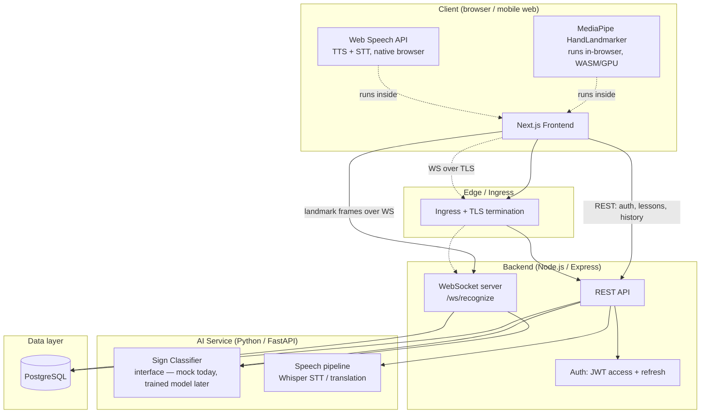

# SignBuddy AI — System Architecture

## 1. High-level architecture



## 2. Why this shape

**Landmark extraction happens client-side, not server-side.** MediaPipe's HandLandmarker runs as WASM/GPU in the browser. This means raw video never has to leave the user's device — only numeric landmark coordinates are transmitted. This is both a latency win (no video upload) and a privacy win (see Security Plan §2).

**Two transport paths exist for recognition: REST and WebSocket.** The REST endpoint (`POST /api/v1/sessions/recognize/sign`) is the simple, stateless path — useful for batch/lower-frequency use and easy to test. The WebSocket channel (`/ws/recognize`) is the production path for continuous live signing, where per-request HTTP overhead would add unacceptable latency. Both call the same AI service and persist to the same table, so they're interchangeable from the data model's point of view.

**The AI service is a separate deployable unit from the backend**, not a library imported into Node. This is deliberate: ML inference has a completely different scaling profile (GPU-bound, bursty) than the API server (CPU-bound, steady), so they need independent horizontal scaling and, eventually, independent hardware (GPU nodes for AI service, standard nodes for backend). See `infra/k8s/02-ai-service.yaml` vs `03-backend.yaml` for the resource profiles this implies.

**The AI service exposes a model-agnostic interface** (`ai-service/pipeline/interfaces.py::SignClassifier`). Today it's backed by `MockSignClassifier`. A trained model is a drop-in replacement — no backend, frontend, or database changes required. This is the single most important seam in the system for the project's actual maturation path (see `ai-service/training/README.md`).

## 3. Request lifecycle: live sign recognition

1. Browser captures camera frames → MediaPipe extracts hand landmarks locally (real, runs today)
2. Frontend batches ~0.8s of landmark frames and sends over the open WebSocket
3. Backend's WS handler forwards the batch to the AI service's `/v1/recognize/landmarks` endpoint
4. AI service classifies the sequence (mock today; trained model later) and returns `{text, confidence, latencyMs}`
5. Backend persists the result as a `session_utterances` row, flags it `low_confidence_flag` if below threshold
6. Backend pushes the result back down the same WebSocket connection
7. Frontend updates the caption panel; if `lowConfidence`, shows the manual-correction affordance; if output mode includes speech, calls the browser's native TTS

Total round-trip target: under 1.5s end-to-end on typical mobile networks (steps 2–6 dominate; step 1 and the TTS call are local and near-instant).

## 4. Data flow & privacy boundary

```
Raw video frame ──(never leaves device)──> MediaPipe landmarks ──> Backend ──> AI Service
                                                  │
                                                  └──> only numeric coordinates + derived text
                                                       are ever stored in PostgreSQL
```

No raw video or audio frame is ever written to disk or database. See Security Plan §2 for the full data classification.

## 5. Failure modes & graceful degradation

| Failure | Behavior |
|---|---|
| AI service unreachable | `/health` reports `aiService: unreachable`; WebSocket recognition requests fail with a clear error the frontend surfaces (`socketError`), rather than hanging silently |
| WebSocket drops mid-session | Frontend shows "Connecting to recognition service…" and the REST fallback path remains available |
| Low confidence recognition | Never silently shown as fact — flagged, with one-tap manual correction (PRD FR4) |
| Database unavailable | Backend `/health` fails its readiness probe; Kubernetes stops routing traffic to that pod rather than serving 500s indefinitely |
| Browser lacks Web Speech API support (e.g. Firefox STT) | Frontend detects this (`useSpeechToText.supported`) and shows an honest message instead of a silently broken mic button |

## 6. Why Postgres, not a NoSQL store

The data is fundamentally relational — users, sessions, utterances, lessons, and progress all have clear foreign-key relationships, and the product needs real joins (e.g., "lessons not yet completed by this user," "average confidence per session"). PostgreSQL's JSONB columns (`accessibility_settings`, `emergency_phrases.translations`) give schema flexibility exactly where the data is genuinely document-shaped, without giving up relational integrity everywhere else.

## 7. Scaling posture (see also `docs/scalability-plan.md`)

- **Frontend**: stateless, horizontally scaled behind the Ingress, CDN-cacheable static assets
- **Backend**: stateless except for the live WebSocket connection per active session; horizontally scaled, HPA on CPU
- **AI service**: the first real bottleneck once a trained model replaces the mock — GPU-backed, separately autoscaled, batching-friendly
- **Database**: vertically scaled first (managed Postgres with read replicas), sharding only considered if usage data shows it's warranted — premature sharding here would be over-engineering for a v1 product
